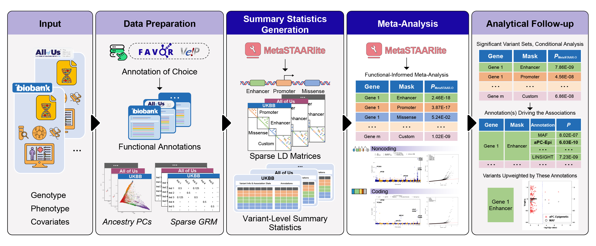

# MetaSTAARlite
This is a lightweight R package for performing association meta-analysis of whole-genome/whole-exome sequencing (WGS/WES) studies using MetaSTAARlite pipeline.
## Description
**MetaSTAARlite** is a lightweight R package for phenotype-genotype association meta-analyses of biobank-scale WGS/WES data, including single variant meta-analysis and variant set meta-analysis. The single variant meta-analysis in MetaSTAARlite provides individual *P* values of variants given a MAF or MAC cut-off. The variant set meta-analysis in MetaSTAARlite includes (1) gene-centric coding meta-analysis, which provides five categories of protein-coding genes: putative loss of function (pLoF), missense, disruptive missense, pLoF and disruptive missense, and synonymous; (2) gene-centric noncoding meta-analysis, which provides one category of noncoding RNA (ncRNA) genes and seven categories of protein-coding genes: promoter or enhancer overlaid with CAGE or DHS sites, UTR, upstream, downstream; (3) support for user-defined custom analysis units (masks). MetaSTAARlite also provides analytical follow-up of dissecting association signals independent of known variants via conditional meta-analysis.
## Workflow Overview

## Prerequisites
<a href="https://www.r-project.org">R</a> (recommended version >= 3.5.1)

For optimal computational performance, it is recommended to use an R version configured with the Intel Math Kernel Library (or other fast BLAS/LAPACK libraries). See the <a href="https://software.intel.com/en-us/articles/using-intel-mkl-with-r">instructions</a> on building R with Intel MKL.
## Dependencies
MetaSTAARlite imports R packages <a href="https://cran.r-project.org/web/packages/Rcpp/index.html">Rcpp</a>, <a href="https://github.com/xihaoli/STAAR">STAAR</a>, <a href="https://github.com/xihaoli/MetaSTAAR">MetaSTAAR</a>, <a href="https://github.com/xihaoli/STAARpipeline">STAARpipeline</a>, <a
href="https://github.com/xihaoli/STAARpipelineSummary">STAARpipelineSummary</a>, <a
href="https://cran.r-project.org/web/packages/dplyr/index.html">dplyr</a>, <a href="https://bioconductor.org/packages/release/bioc/html/SeqArray.html">SeqArray</a>, <a href="https://bioconductor.org/packages/release/bioc/html/SeqVarTools.html">SeqVarTools</a>, <a href="https://bioconductor.org/packages/release/bioc/html/GenomicFeatures.html">GenomicFeatures</a>, <a href="https://bioconductor.org/packages/release/data/annotation/html/TxDb.Hsapiens.UCSC.hg38.knownGene.html">TxDb.Hsapiens.UCSC.hg38.knownGene</a>, <a href="https://cran.r-project.org/web/packages/Matrix/index.html">Matrix</a>, <a
href="https://cran.r-project.org/web/packages/expm/index.html">expm</a>, <a
href="https://cran.r-project.org/web/packages/MASS/index.html">MASS</a>. These dependencies should be installed before installing MetaSTAARlite.
## Installation
```
library(devtools)
devtools::install_github("li-lab-genetics/MetaSTAARlite",ref="main")
```
## Usage
Please see the <a href="docs/MetaSTAARlite_manual.pdf">**MetaSTAARlite** user manual</a> for detailed usage of MetaSTAARlite package. Please see the <a href="https://github.com/li-lab-genetics/MetaSTAARlite-Tutorial">**MetaSTAARlite** tutorial</a> for a detailed example of meta-analyzing sequencing data using MetaSTAARlite.
## Data Availability
The whole-genome functional annotation data assembled from a variety of sources and the precomputed annotation principal components are available at the [Functional Annotation of Variant - Online Resource (FAVOR)](https://favor.genohub.org) site and [FAVOR Essential Database](https://doi.org/10.7910/DVN/1VGTJI).
## Version
The current version is 0.9.6 (February 27, 2025).
## Citation
If you use **MetaSTAARlite** for your work, please cite:

Xihao Li, Corbin Quick, Hufeng Zhou, Sheila M. Gaynor, Yaowu Liu, Han Chen, Margaret Sunitha Selvaraj, Ryan Sun, Rounak Dey, Donna K. Arnett, Lawrence F. Bielak, Joshua C. Bis, John Blangero, Eric Boerwinkle, Donald W. Bowden, Jennifer A. Brody, Brian E. Cade, Adolfo Correa, L. Adrienne Cupples, Joanne E. Curran, Paul S. de Vries, Ravindranath Duggirala, Barry I. Freedman, Harald H. H. Göring, Xiuqing Guo, Jeffrey Haessler, Rita R. Kalyani, Charles Kooperberg, Brian G. Kral, Leslie A. Lange, Ani Manichaikul, Lisa W. Martin, Stephen T. McGarvey, Braxton D. Mitchell, May E. Montasser, Alanna C. Morrison, Take Naseri, Jeffrey R. O'Connell, Nicholette D. Palmer, Patricia A. Peyser, Bruce M. Psaty, Laura M. Raffield, Susan Redline, Alexander P. Reiner, Muagututi’a Sefuiva Reupena, Kenneth M. Rice, Stephen S. Rich, Colleen M. Sitlani, Jennifer A. Smith, Kent D. Taylor, Ramachandran S. Vasan, Cristen J. Willer, James G. Wilson, Lisa R. Yanek, Wei Zhao, NHLBI Trans-Omics for Precision Medicine (TOPMed) Consortium, TOPMed Lipids Working Group, Jerome I. Rotter, Pradeep Natarajan, Gina M. Peloso, Zilin Li, & Xihong Lin. (2023). **Powerful, scalable and resource-efficient meta-analysis of rare variant associations in large whole genome sequencing studies**. _Nature Genetics_, _55_(1), 154-164. PMID: <a href="https://www.ncbi.nlm.nih.gov/pubmed/36564505">36564505</a>. PMCID: <a href="https://www.ncbi.nlm.nih.gov/pmc/articles/PMC10084891/">PMC10084891</a>. DOI: <a href="https://doi.org/10.1038/s41588-022-01225-6">10.1038/s41588-022-01225-6</a>.
## License
This software is licensed under GPLv3.


[GNU General Public License, GPLv3](http://www.gnu.org/copyleft/gpl.html)
